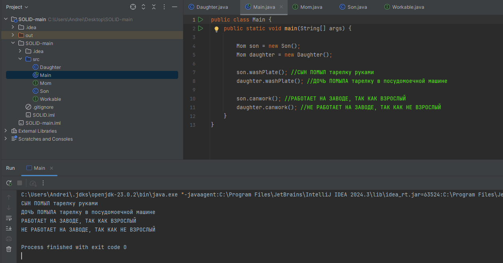

# $${\color{#ff0048}SOLID \space \color{#00f0ec}PROJECT}$$

## Описание 
:rocket: **Консольный проект, который иллюстрирует работу принципов SOLID**
 

## Использованные технологии
:white_check_mark:   JAVA
:white_check_mark:   SOLID
## Установка 
**Склонируйте репозиторий и запустите проект через редактор кода (IntelliJ IDEA)**
 
:black_square_button: :black_square_button: :black_square_button:

